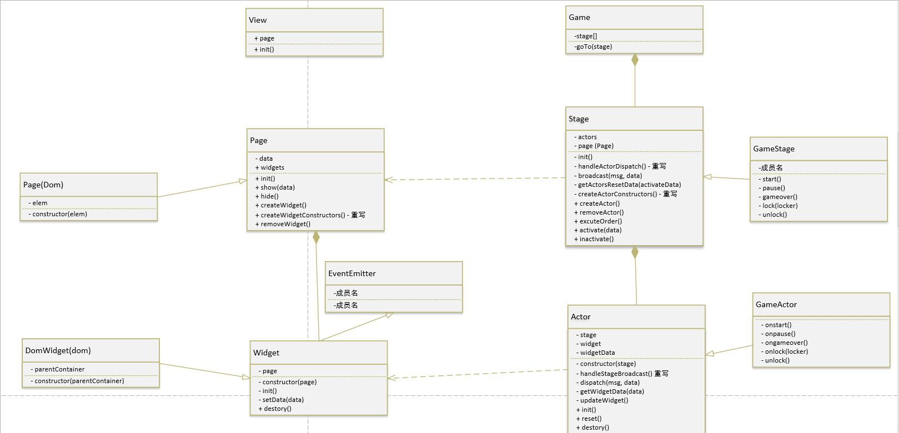

# 说明

为了不浪费时间，本次实现不局限于实现这一个游戏！所以会有比较多结构上的代码。


UML 类图


## 运行
直接用浏览器打开根目录 index.html。

或
```
npm i
npm run dev
// 浏览器访问 localhost:9123
```
使用 webpack 构建

或浏览在线版
[http://gnauhca.com/dailyeffecttest/gobang/index.html](http://gnauhca.com/dailyeffecttest/gobang/index.html)

## 实现

游戏实现抽象成每个游戏界面是一个舞台 （Stage），游戏元素（如棋盘，计时员）是一个演员(Actor)，
而游戏界面就是演员手上举得牌子，或是衣服（这里是 widget 类）


## 视图

想要用不同的方法实现视图，修改 widget 就可以了。项目我会上传我的 [github](https://github.com/gnauhca/dailyeffecttest/tree/master/gobang) 

由于要求原生代码实现，canvas 需自行实现事件监听，所以本次选用 dom 实现，而且只是为了快速实现，css 会很随便。后续我有时间会实现 canvas 版，或是 three.js 版。

## 人机

机器下棋具体算法就不实现了，现在是每一步机器人随机下一个坐标，计算下子坐标的方法在 `robotActor` 的 `calNextPiece` 方法里.

机器算法大概想法就是计算每个坐标的价值，越多赢得可能性价值越高。如果发现对方有比我方价值更高的坐标，就把棋下到对方那个坐标，否则现在我方价值最高的坐标。

